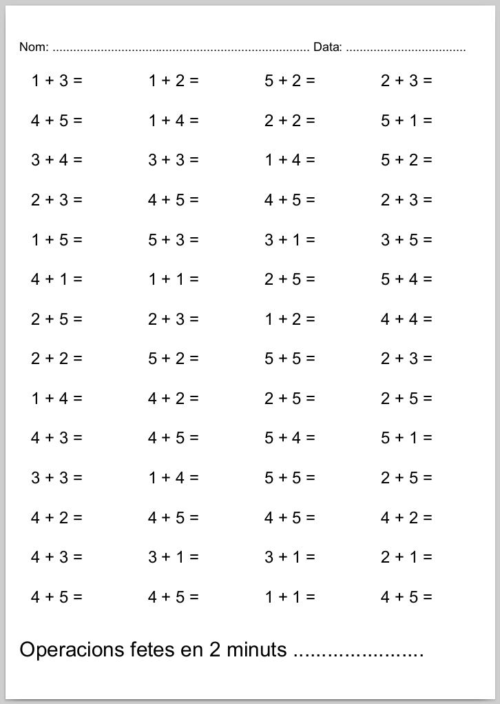
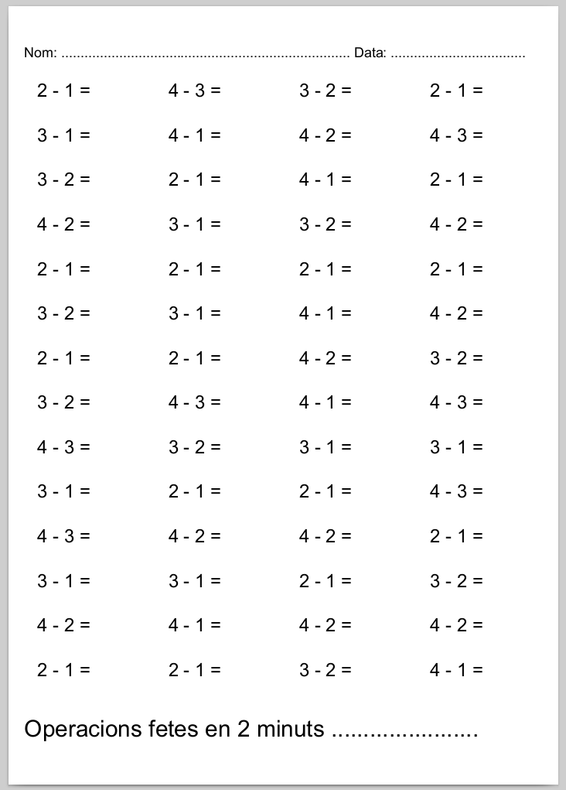

# generador de curses matemàtiques

Generador aleatòri de sumes i restes a completar en dos minuts

## Exemples

### Sumes



### Restes



## Opcions

### Opcions generals

```
jprats@shuvak:~/git/python-matecurses$ python3 matecursa.py 
Usage: matecursa.py [OPTIONS] COMMAND [ARGS]...

Options:
  --help  Show this message and exit.

Commands:
  restes
  sumes
```
### Opcions sumes

```
jprats@shuvak:~/git/python-matecurses$ python3 matecursa.py sumes --help
Usage: matecursa.py sumes [OPTIONS]

Options:
  --file TEXT                  output file
  --pages INTEGER              number of pages
  --min INTEGER                min int
  --max INTEGER                max int
  --min-segona-unitat INTEGER  max int segona unitat
  --max-segona-unitat INTEGER  max int segona unitat
  --help                       Show this message and exit.
```
### Opcions restes

```
jprats@shuvak:~/git/python-matecurses$ python3 matecursa.py restes --help
Usage: matecursa.py restes [OPTIONS]

Options:
  --file TEXT      output file
  --pages INTEGER  number of pages
  --min INTEGER    max int
  --max INTEGER    max int
  --help           Show this message and exit.
jprats@shuvak:~/git/python-matecurses$ 
```