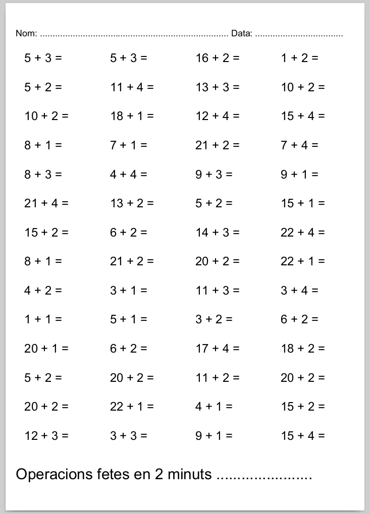

# generador de curses matemàtiques

Generador aleatòri de sumes i restes a completar en dos minuts

[📚 documentació](https://jordiprats.github.io/python-matecurses/)

## Exemples

### Sumes simples

```
python3 matecursa.py sumes
```


### Sumes amb el primer digit de dos números

```
python3 matecursa.py sumes --max 25 --min-segona-unitat 1 --max-segona-unitat 5
```



### Restes

```
python3 matecursa.py restes
```


